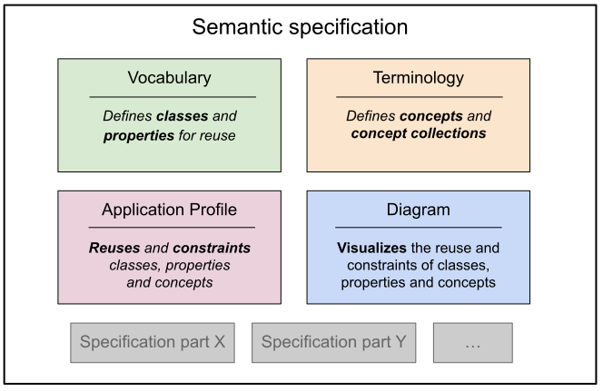

# Interoperable Specifications Profile

The purpose of this profile is to promote interoperability through reuse of classes, properties and concepts across specifications. By reuse we mean using the same identifiers and therefore share the formal definitions, not just names. The intention is to allow the information models of specifications to form a larger network of definitions that can act as a basis for interoperability, improved quality, quicker development time and a supportive community with a shared knowledge base. 

The requirements of interoperable specification are expressed in the form of a profile, this means that the requirements are expressed as special uses / pattern of something existing rather than introducing something entirely new. Absolute requirements are expressed with MUST / MUST NOT, strong requirments with SHOULD / SHOULD NOT and finally MAY for weaker recommendations, see [RFC 2119](https://www.ietf.org/rfc/rfc2119.txt) for a longer treatment.

## Short introduction

A specification has historically often been seen as a specification document containing a mixture of background, motivation and more formal descriptions. A more modern way of looking at a specification is that it is a package of resources, some targeted towards human consumption while others towards processing by machines.

At the core of most specification is an **information model** that describes how data is expressed. An information model can be described informally in a specification document but can also be expressed more formally using a modelling language such as UML, ER-diagrams, OWL or RDFS. The information model is often expressed in terms of **classes**, **properties** (attributes and relations) as well as **concepts**. In addition, there is nearly always a visualization, typically in the form of a UML class **diagram**.

A consequence of aiming for reuse of classes and properties is that they need to defined more loosely so they are flexible enough to be combined in different ways. For instance, the property `publisher` from the Dublin Core Metadata Initiative is described in a sufficient generic manner so it can be applied to both a `Text` and a `Dataset`. Consequently, there is a need to describe how they are combined in a specific setting, we refer to this as an **application profile**.

Taken together, the following resources will have special roles in an interoperable specification:

* **data vocabulary** a container for:
    * **classes** that describes the kind of entities that exists in the data
    * **properties** corresponding to attributes on or relations between classes 
* **terminology** a container for:
    * **concepts** provides fixed values with predefined meeting to be used as values in the data
    * **concept collection** a set of collections assembled for a specific purpose
* **application profile** provides a mechanism for describing how classes, properties and concepts are combined in new settings
* **diagrams** provides visualizations of the information model

Note 1 - diagrams are mostly valuable as a help for humans for getting an overview not for specifying formal information (which is provided in the vocabulary, terminology and application profile).

Note 2 - an interoperable specification may contain more resources than those mentioned above but this profile does not proscribe how they should be understood or treated.

## Profile parts

1. [Background and motivation](docs/background.md) 
2. [Conceptual design and definitions](docs/design.md) 
3. [Rules for interoperable specifications](docs/rules.md) ⇐ (**the formal specification**)
4. [Application Profiles as SHACL-INSPEC](docs/ap.md)
5. Harvesting interoperable specifications 
   1. Flavour 1 - natively according to profile 
   2. Flavour 2 - via UML according to the OSLO principles 
   3. Flavour 3 - via tabular annotations (CSV on the web)
6. Bootstrapping specifications used in the different flavours
   1. RDFS 
   2. SHACL 
   3. UML-OSLO 
   4. CSV 
   5. SKOS-SE 
   6. DCAT-AP-SE
7. RDF considerations
   1. Divisions into named graphs
8. [Example specification according to the profile](docs/example.md)

## Who this profile targets

The interoperable specification profile targets anyone who has the task of describing an information model and is either required to or sees an added value in reusing classes, properties and concepts when possible. An added value could be improved quality, quicker development time and/or a supportive community with a shared knowledge base to lean on. An example of a more harsh requirement is *"the result should be interoperable with existing intiatives"*. Sometimes the requirement is expressed in law.

## Delimitations

This profile does note take a stance on specific tools.

## Process for the development of the profile

The interoperable specification profile is beeing developed as part of the metadata working group within Ena, Swedish digital infrastructure. 
The work is led by [Agency for Digital Government (Digg)](https://www.digg.se).

For more details, see the [separate page with planned meetings, slides, notes, reference group etc.](process/index.md).

## How to give feedback

- Create and comment on issues in Github
- Create pull-requests for concreate changes
- Participate in the reference group meetings
- Send mail to [info@digg.se](mailto:info@digg.se) for other questions or to reach out to get involved
