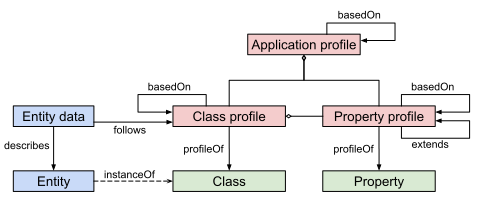

# Application Profile Conceptual Model

The purpose of an application profile is to clarify in more detail on how to reuse classes, properties and concepts in new settings.

Let's repeat the central terminology we are using:

* Entity - a distinct thing/instance/individual that appears in a dataset
* Entity data - data in the dataset focused on a specific entity by referring to it via its identifier (a URI)
* Class - a set of entities of the same kind / character / category
* Property - a specific characteristic of an entity
* Class Profile - a set of common characteristics of entities
* Property Profile - clarifies the use of a property in a class profile
* Application Profile - groups a set of entity and property profiles together for a certain domain/use case

For simplicity the requirement on multilinguality are not written explicitly below, i.e. labels, description / definition and usage note are all expected to be expressed with a language and potentially translated in several languages. 

### Application Profile

The following information MUST be provided for an application profile:

* A stable identity in the form of a URI (subject position in triples)
* A label

The following information MAY be provided:

* A description / definition
* A usage note
* Reference to another application profile it is based on

### Entity Profile

The following information MUST be provided for an entity profile:

* A stable identity in the form of a URI (subject position in triples)
* Reference to the application profile it belongs to
* The class it corresponds to
* A label
* A list of ordered Property Profiles
* A mark if it is a main or supportive entity profile

The following information MAY be provided:

* A description / definition
* A usage note
* A reference to another entity profile it is based on

### Property Profile

The following information MUST be provided for a property profile:

* A stable identity in the form of a URI (subject position in triples)
* A reference to the application profile it belongs to
* The property it describes how to use
* A label
* Express mandatory, preferred or optional as well as the max cardinality
* The value type to match against (URI, literal or blank node)

The following information MAY be provided:

* A description / definition
* A usage note
* That a datatype is required on literals (there might be one or several allowed datatypes)
* That a language is required on literals
* Constraints on which literals that is allowed by:
    * An explicit list
    * A constraining pattern (Regular expression)
* Constraints on which URIs that is allowed by:
    * An explicit list
    * A constraining URI pattern (Regular expression)
    * Constrain to concepts in an terminology
    * Constrain to concepts in a concept collection
    * Constrain to instances of a class
* A reference to a another property profile:
    * that it refines OR
    * that it is based on
