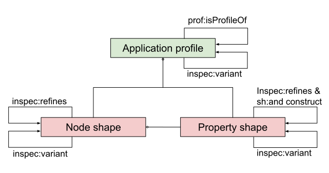

# Application Profile - SHACL-INSPEC

The purpose of an application profile is to clarify in more detail on how to reuse classes, properties and concepts in new settings.
The needs can to a large extent be covered by the SHACL Shapes Constraint Language, a language for validating RDF graphs against a set of conditions.
However, SHACL is too flexible for the use case of application profiles, hence we define the SHACL-INSPEC to capture the specific requirements / constraints that needs to be met when using SHACL for expressing application profiles. (A side note is that SHACL-INSPEC itself is formally an application profile of SHACL and could therefore be expressed with the help of itself. In time this will perhaps be done, but for now we ignore this as it most likely cause more confusion rather than help to clarify.)

## Glossary

Let's clarify the words we are using in SHACL-INSPEC:

* Entity - a distinct thing/resource/instance/individual described in a dataset
* Property - a specific characteristic of an entity
* Class - a set of entities of the same kind / character / category
* Data graph - data about an entity expressed as RDF
* Node - a reference to a entity in a data graph
* Triple - a fact/statement about an entity (via a node) in a data graph
* Property Shape - constrains the triple expression for a certain property
* Node Shape - joins a set of property shapes into a larger constraint
* Application Profile - groups a set of node and property shapes together for a certain domain/use case

## Application Profile expression

If you have not already, take a look at the [fourteen rules of SHACL-INSPEC](rules.md#rules-for-application-profiles---shacl-inspec).
These rules may be a bit hard to take in, especially since SHACL is a complex language. Hence, below we list what is to be expected based on the application profile as a whole as well as on the shapes.

First of all, for simplicity the requirement on multilinguality are not written explicitly below, i.e. labels, description / definition and usage note are all expected to be expressed with a language and potentially translated into several languages.

The following picture shows the important relations between the different parts of an application profile expression:


### Application Profile resource

The following information MUST be provided for an application profile resource:

* The application profile resource must have a stable identity in the form of a URI (subject position in triples)
* The application profile resource must be typed as `prof:Profile`
* A label expressed via the property `sh:name`
* A list of public node shapes indicated via the property `dcterms:hasPart`
* A list of public property shapes indicated via the property `dcterms:hasPart`

The following information SHOULD/MAY be provided:

* A list of all classes and properties used in the application profile, indicated via the properties `inspec:reuses` or `inspec:introduces`
* A description / definition expressed via the property `sh:description`
* A usage note expressed via the property `skos:scopeNote`
* A reference to another application profile that expresses that it is a
  * "subprofile" of another profile via `prof:isProfileOf`
  * "variant of" another profile via the `inspec:variant`

Note that for B being a subprofile of A:

* Data following application profile B will also follow application profile A.
* Data following application profile A will not always follow application profile B.

Note also that the concepts of Application profiles being subprofiles and variant of each other of are exclusive since for the variant relation there is a requirement that at least one of the node shapes has to be a variant.

### Main and supportive node shapes

Note that there are node shapes of more technical nature that are excluded from the requirements below, all those must have a `sh:severity` set to `sh:INFO` or `sh:WARNING`. For example this covers node shapes pointed to via `sh:node` used to express more complex constraints such as indicating which terminology to choose concepts from.

The following information MUST be provided for a node shape:

* A stable identity in the form of a URI (subject position in triples)
* A label expressed via the property `sh:name`
* A list of property shapes via the property `sh:property` (see [section on defining order](#order))
* (For main node shapes) The class it corresponds to via the target declaration `sh:targetClass`

The following information SHOULD/MAY be provided:

* A description / definition expressed via the property `sh:description`
* A usage note expressed via the property `skos:scopeNote`
* A reference to another node shape it
  * "refines" via `inspec:refines` AND `sh:and` with a SHACL list containing the refined node shape (see [section on refinement](#node_refinement)), OR
  * "is a variant of" via the `inspec:variant` property (see [section on variants](#node_variant))

### Property Shapes pointed to from main and supportive node shapes

Note that there are property shapes of more technical nature that are excluded from the requirements below. Property shapes are either excluded as they are referred to only from excluded node or from logical constraint components.  

The following information MUST be provided for a property shape:

* A stable identity in the form of a URI (subject position in triples)
* A label expressed via the property `sh:name`
* The property it describes how to use via `sh:path`
* The value type to match against, `sh:nodeKind` pointing to `sh:IRI`, `sh:BlankNode`, `sh:Literal` etc.

The following information SHOULD/MAY be provided:

* Express cardinality by:
  * `sh:minCount "1"^^xsd:integer` for mandatory
  * `sh:minCount "0"^^xsd:integer` for preferred
  * `sh:minCount "-1"^^xsd:integer` for optional (or, if left out it should be interpreted as -1)
  * `sh:maxCount "N"^^xsd:integer` for a maximum cardinality of `N`
* A description / definition expressed via the property `sh:description`
* A usage note expressed via the property `skos:scopeNote`
* That a datatype is required on literals by using `sh:datatype` (if several datatypes are allowed, a construction with several property shapes with individual `sh:datatype` joined together via `sh:or` is necessary)
* That a language is required on literals by setting `sh:datatype` to `rdf:langString`
* Constraints on which literals that is allowed by:
  * An explicit list by using `sh:in` pointing to a SHACL list
  * A constraining pattern expressed by `sh:pattern` (Regular expression)
* Constraints on which URIs that is allowed by:
  * An explicit list by using `sh:in` pointing to a SHACL list
  * A constraining URI pattern expressed by `sh:pattern` (Regular expression)
  * Constrain to concepts in a terminology (see [section below](#terminology))
  * Constrain to concepts in a concept collection (see [section below](#collection))
  * Constrain to instances of a class by `sh:class` (if instances from several classes are allowed, a construction with several property shapes with `sh:class` joined together via a `sh:or` is necessary)
* A reference to another property shape it:
  * "refines" via `inspec:refines` AND `sh:and` with a SHACL list containing the refined property shape (see [section on property refinement](#property_refinement)), OR
  * "is variant of" via the `inspec:variant` property (see [section on property variants](#property_variant))

## Property shape refinement - how to refine/specialize/inherit property shapes ([Rule AP-7](rules.md#ap7))

<a id="property_refinement"></a>

SHACL allows shapes to be combined via `sh:and`. This can be used to specialize an existing shapes with additional constraints or further restricting. We also express the relation directly to the property shape being refined via the `inspec:refines`, this is due to the `sh:and` construction being a bit obscure and it can be hard to distinguish from other expressions when querying. E.g. consider the following property shape for the property `dcterms:publisher` where the range is `foaf:Agent`.

```turtle
ex:ps-publisher a sh:PropertyShape ;
  sh:label "Publisher" ;
  sh:path dcterms:publisher ;
  sh:nodeKind sh:IRI ;
  sh:minCount "1" ;
  sh:class foaf:Agent .
```

we can further constrain it to the subclass `foaf:Organization` via the following construction:

```turtle
ex:ps-publisher2 a sh:PropertyShape
  sh:path dcterms:publisher ;
  sh:class foaf:Organization ;
  inspec:refines ex:ps-publisher ;
  sh:and ( ex:ps-publisher ) .
```

Note that at a minimum we have to duplicate the `sh:path` property.

## Property shape variants - when property refinement breaks down ([Rule AP-8](rules.md#ap8))

<a id="property_variant"></a>

Note that we are not allowed to relax constraints via the refinement construction since it is a conjunction. For instance if we need to relax the constraint and make the publisher optional we cannot specialize the property shape, instead we have to duplicate all information. But we can still provide an indication that we have provided a "variant" of our property shape via the `inspec:variant` property like this:

```turtle
ex:ps-publisher3 a sh:PropertyShape ;
  sh:label "Publisher" ;
  sh:path dcterms:publisher ;
  sh:nodeKind sh:IRI ;
  sh:class foaf:Agent ;
  inspec:variant ex:ps-publisher .
```

Note that for node shapes it is more common to have "variants" as you often want to change the order or include a slightly different set of property shapes.

## Node shape refinement - how to refine/specialize/inherit node shapes ([Rule AP-9](rules.md#ap9))

<a id="node_refinement"></a>

The `sh:and` construction used for property shapes cannot be used for node shape refinement since it would not let us indicate which property shapes that are refined (they would be mixed in a unclear manner and it would also be problematic if we need to change the order, see [section on order](#order)). Instead we have to make a new node shape. Luckily we can refer directly to all public property shapes that we want to use as is. In addition we point out the property shape we are refining via the `inspec:refine` property.

Let us introduce a node shape for a book profile that we want to extend including it's two property shapes (we define the property shape ps-publisher from above again to make it easier to read):

```turtle
ex:ns-book a sh:NodeShape ;
  sh:label "Book"@en ;
  sh:property ex:ps-title, ex:ps-publisher .
ex:ps-title a sh:PropertyShape ;
  sh:path dcterms:title ;
  sh:nodeKind sh:Literal ;
  sh:label "Title"@en ;
  sh:order "1"^^xsd:decimal ;
ex:ps-publisher a sh:PropertyShape ;
  sh:label "Publisher" ;
  sh:path dcterms:publisher ;
  sh:nodeKind sh:IRI ;
  sh:minCount "1" ;
  sh:class foaf:Agent .
```

Now we want to extend the book profile with the publisher restricted to organizations (again we duplicate the property shape ps-publisher2 from above for readability):

```turtle
ex:ns-book2 a sh:NodeShape ;
  sh:label "Book2"@en ;
  inspec:refines ex:ns-book ;
  sh:property ex:ps-title, ex:ps-publisher2 .
ex:ps-publisher2 a sh:PropertyShape
  sh:path dcterms:publisher ;
  sh:class foaf:Organization ;
  inspec:refines ex:ps-publisher ;
  sh:and ( ex:ps-publisher ) .
```

## Node shape variant - provide variants of node shapes ([Rule AP-10](rules.md#ap10))

<a id="node_variant"></a>

The solution for node shape variants is very similar to refinements, we can look at an example directly (again we repeat everything for readability):

```turtle
ex:ns-book a sh:NodeShape ;
  sh:label "Book"@en ;
  sh:property ex:ps-title, ex:ps-publisher .
ex:ps-title a sh:PropertyShape ;
  sh:path dcterms:title ;
  sh:nodeKind sh:Literal ;
  sh:label "Title"@en ;
  sh:order "1"^^xsd:decimal ;
ex:ps-publisher a sh:PropertyShape ;
  sh:label "Publisher" ;
  sh:path dcterms:publisher ;
  sh:nodeKind sh:IRI ;
  sh:minCount "1" ;
  sh:class foaf:Agent .
```

Now to provide a variant of the book profile we use the `inspec:variant` property (again we duplicate the property shape ps-publisher3 from above for readability):

```turtle
ex:ns-book3 a sh:NodeShape ;
  sh:label "Book2"@en ;
  inspec:variant ex:ns-book ;
  sh:property ex:ps-title, ex:ps-publisher3 .
ex:ps-publisher3 a sh:PropertyShape ;
  sh:label "Publisher" ;
  sh:path dcterms:publisher ;
  sh:nodeKind sh:IRI ;
  sh:class foaf:Agent ;
  inspec:variant ex:ps-publisher .
```

## Providing order of property shapes

<a id="order"></a>

An important aspect of application profiles is to generate specification documents in a predictable manner. Furthermore, since we aim for multilinguality the order cannot be based on alphabetical sorting of labels. Consequently we outline two rules:

1. Provide an explicit order of all property shapes via `sh:order`.
2. Sort all property shapes that have no sh:order via the alphabetical order of the localname of the property given via sh:path.

Note that if two property shapes have the same property, they must be separated by an explicit `sh:order`.

> It is a strong recommendation to always provide an explicit order on every property shape.

If you are reusing property shapes in new settings (e.g. in specialization of node shapes) you may want to change the order. Lets consider the example where we have a profile for a book with a title and an identifier:

```turtle
ex:ns2 a sh:NodeShape ;
  sh:label "Book"@en ;
  sh:property ex:ps-title, ex:ps-identifier .
ex:ps-title a sh:PropertyShape ;
  sh:path dcterms:title ;
  sh:nodeKind sh:Literal ;
  sh:label "Title"@en ;
  sh:order "1"^^xsd:decimal ;
ex:ps-identifier a sh:PropertyShape ;
  sh:path dcterms:identifier ;
  sh:nodeKind sh:Literal ;
  sh:label "Identifier"@en ;
  sh:order "2"^^xsd:decimal ;
```

To change the order so the `dcterms:identifier` is at the top you can make a minimal specialization of that property shape with another `sh:order`:

```turtle
ex:ns2 a sh:NodeShape ;
  sh:label "Book 2"@en ;
  sh:property [
      sh:path dcterms:identifier ;
      sh:order "0.5"^^xsd:decimal ;
      sh:and ( ex:ps-identifier ) .
    ], ex:ps-title .
```

Note that you have to repeat the `sh:path` due to SHACL rules. We have chosen to not give the new property shape a URI since it does not provide any additional value beyond the order, which is specific to the node shape. This is possible since it does not fall under the [Rule AP-3](rules.md#ap3) rule since `sh:and` is excluded, `sh:path` is not a constraint and an `sh:order` is a characteristic (i.e. a non-validating property). The property shape should therefore be considered **private** (as opposed to public).

## Restricting to concepts in a terminology

<a id="terminology"></a>

To restrict to concepts in a terminology you should specify:

1. That you are expecting instances of the class `skos:Concept`.
2. That you are expecting the concepts to have a `skos:inScheme` property pointing to the terminology.
3. A regular expression for the concept URIs (optional).

```turtle
ex:ps1 a sh:PropertyShape ;
  sh:path dcterms:subject ;
  sh:pattern "^http://example.com/terminologyA/.*$" ;
  sh:node [
      a sh:NodeShape ;
      sh:severity sh:Info ;
      sh:property [
        sh:path rdf:type ;
        sh:hasValue skos:Concept
      ], [
        sh:path skos:inScheme ;
        sh:hasValue ex:terminologyA
      ]
    ]
```

The reason we set the `sh:severity` to `sh:Info` is that if we try validate a data graph against this SHACL expression we do not always expect to have the entire terminology loaded with `rdf:type` and `skos:inScheme` triples for all concepts. In this case we instead rely on the `sh:pattern` to give us a more syntactical indication that the URI in the data graph corresponds to a correct concept. The expression with `rdf:type` and `skos:inScheme` (1 & 2 above) is provided to allow us to both detect that this is in fact a terminology when we render the specification and a more correct way to search for the intended concepts.[^1]

[^1]: We here introduced a node shape and two property shapes which we consider to be private (as opposed to public, see [AP-3](rules.md#ap3) and [AP-4](rules.md#ap4)) as they are primarily a technical construction. This also necessitates setting the `sh:severity` below `sh:VIOLATION` but allows us to use blank blank nodes for these shapes.

## Restricting to concepts in a concept collection

<a id="collection"></a>

To restrict to concepts in a concept collection you should specify:

1. That you are expecting instances of the class `skos:Concept`.
2. That you are expecting the concept collection to have a `skos:member` property pointing to the concepts.

Add missing section on Restricting to concepts in a concept collection

The section was purposefully kept very similar to the section on Restricting to concepts in a terminology

```turtle
ex:ps1 a sh:PropertyShape ;
  sh:path dcterms:subject ;
  sh:node [
      a sh:NodeShape ;
      sh:severity sh:Info ;
      sh:property [
        sh:path rdf:type ;
        sh:hasValue skos:Concept
      ], [
        sh:path [
          sh:inversePath skos:member
        ] ;
        sh:hasValue ex:collectionA
      ]
    ]
```

The reason we set the `sh:severity` to `sh:Info` is that if we try validate a data graph against this SHACL expression we do not always expect to have the entire terminology loaded with `rdf:type` and `skos:member` triples for all concepts in the collection. The expression with `rdf:type` and `skos:member` (1 & 2 above) is provided to allow us to both detect that this is in fact a concept collection when we render the specification and a more correct way to search for the intended concepts.[^1]

## Anti patterns

### Multiple top-level property shapes for the same triple

SHACL allows a node shape to include multiple property shapes that together constrain a single triple. For instance, one property shape may constrain the node type and another the cardinality. This is problematic and should be avoided as it both makes it hard to generate documentation and complicates reuse. E.g. the following example is not encouraged:

```turtle
ex:ns1 a sh:NodeShape ;
  sh:label "Person" ;
  sh:property ex:ps1, ex:ps2 .
ex:ps1 a sh:PropertyShape ;
  sh:label "Name" ;
  sh:path foaf:givenName ;
  sh:nodeKind sh:Literal .
ex:ps2 a sh:PropertyShape ;
  sh:path foaf:givenName ;
  sh:minCount "1" .
```

Instead the expression should be done via a single property shape:

```turtle
ex:ns1 a sh:NodeShape ;
  sh:label "Person" ;
  sh:property ex:ps1 .
ex:ps1 a sh:PropertyShape ;
  sh:label "Name" ;
  sh:path foaf:givenName ;
  sh:minCount "1" .
  sh:nodeKind sh:Literal .
```

However, there are situations where the same property is reused on the same node for different reasons. But then the constraints should be made in such a way that the triples matched for each property shape are disjoint. Mechanism to ensure that they match different sets of triples includes `sh:nodeKind` and `sh:pattern`. The following example shows how to point to two different sets of concepts using the same property (`foaf:topic_interests`):

```turtle
ex:ns1 a sh:NodeShape ;
  sh:label "Person" ;
  sh:property ex:ps1, ex:ps2 .
ex:ps1 a sh:PropertyShape ;
  sh:label "Hobbies" ;
  sh:path foaf:topic_interests ;
  sh:nodeKind sh:IRI ;
  sh:pattern "^http://example.com/hobbies/.*$";
ex:ps2 a sh:PropertyShape ;
  sh:label "Professional interests in computer science" ;
  sh:path foaf:topic_interests ;
  sh:nodeKind sh:IRI ;
  sh:pattern "^http://example.com/computer_science/.*$";
```

Read the chapter "[Using the same property for different purposes](property-reuse.md)" for a longer background and recommendations on when it is suitable to reuse properties in this manner.
