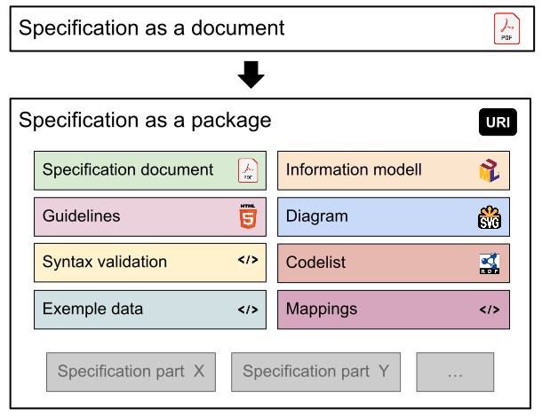

# Background and motivation

We will start by looking into what we mean with specifications and then move over to interoperable specifications.

## Specifications getting more complex

With a specification we mean an expression that specifies how data in a dataset should be expressed and understood.

Historically specifications have often been considered to be documents written for human consumption. But in a modern setting this is not enough, a specification has to be capable to encompass a set of distinct resources. The traditional specification document is itself perhaps the most important of these resources, but in addition there are resources corresponding to schemas, guidelines, diagrams, terminologies and an information model. Some of these resources are directed towards humans, while others are useful for machines, e.g. to validate that data is expressed according to the intentions of the specification.

With these requirements we choose to define a specification as a container that consists of one or more resources. It is crucial that the specification itself and its resources are given identifiers in the form of URIs that can be used to reference them, e.g. to express that a dataset is conformant to it. Note that with this definition a specification is not a document any more, it is not even a digital entity. Rather a specification is something abstract that has to be understood by its descriptive metadata and the resources it contains (and the metadata that describes them).

To learn more about an individual specification and its resources we need metadata that describes them, this is accomplished by relying on RDF, more specifically the [PROF vocabulary](https://www.w3.org/TR/dx-prof/).

It is important to recognize that specification authors have different ambitions when it comes to expressing specifications. Some specifications will be nothing more than documents, typically accessible as PDFs or as webpages. Others want to take a step further and provide a larger set of resources perhaps a machine readable information model.

## Interoperable specifications

We live in an increasingly digital world where data is supposed to be exchanged and understood in new contexts all the time. Hence, the need for well written specifications is increasing. It is also the case that many specifications have large similarities, for instance, there is often a need to express information around persons, organizations, places, events etc.

The purpose of the interoperable specifications profile is to provide a mechanism for reusing parts, let's call them definitions, of specifications when creating new specifications.

There are many potential added values:

* Quicker development of new specifications as you do not have to start from scratch.
* Improved quality since reused parts have been battle tested.
* Shorter learning time if new specifications have fewer new unique definitions.
* Data from different specifications can be partially interoperable.

Furthermore, there are several implications for the specification writers:

* The methodology will turn away from defining everything from scratch towards research and adaption of what exists when possible.
* Necessary new definitions should be expressed carefully with the intention of furthering reuse in other contexts.
* Reuse of definitions needs to be documented, often in the form of contextualization and refinement.
* Documenting definitions and specifications in a common format with stable identifiers becomes paramount.
