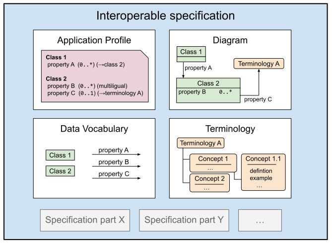

# Conceptual design

We start by identifying which parts of a specification we want to reuse. In short we want to focus on the information model and fixed value lists / terminologies we use in conjunction with it. Hence, we want to reuse the following constituents across specification borders:

* **Classes**
* **Properties** (attributes and relations) (*)
* **Concepts** (fixed values)

To contextualize the classes, properties and concepts in a specification a new specification is needed, the mechanism is referred to as an **application profile**.

Since classes and properties often are introduced together it will make sense to refer to them as a **data vocabulary**.

Concepts are often managed together in a **terminology** (or code lists). Sometimes it will be necessary to select a smaller set of concepts from a single or across several terminologies, then we will just refer to them as a **concept collection**.

There are organizations that focus on providing generic data vocabularies, e.g. Dublin Core, FOAF, VCard etc. that will be part of many specifications. The same applies to well known terminologies like GEMET and the authority tables of the European Unions publication office. To avoid confusion regarding the origin of data vocabularies and terminologies they should be included in specifications with a special "**reused" mark**".

Furthermore, there is a need to have interoperable specifications that does nothing else than introduce these generic data vocabularies or terminologies (without the reuse mark). Hence, we introduce:

**Vocabulary specification** - a specification containing only a data vocabulary without the reuse mark. It is not allowed to contain an application profile or a terminology.

**Terminology specification** - a specification containing only a terminology without the reuse mark. It is not allowed to contain an application profile or a vocabulary.

Vocabulary and terminology specifications are not stand alone in the sense that a dataset can be fully understood solely based on a claim that it conforms to them. Hence, we do not consider vocabulary and terminology specifications to be interoperable specifications. However, from a harvesting perspective they are crucial for providing a mechanism to avoid duplication of data vocabularies and terminologies.

(*) Those familiar with UML may notice something different here, attributes and relations are in UML always bound to the class where they are introduced. The only way to let them have a wider applicability is to introduce subclasses. Allowing reuse of properties (attributes and relations) and apply them to classes in new contexts is indeed something different from the traditional object oriented paradigm. However, treating both classes and properties as reusable building blocks that can be repurposed in new settings is the best practise in the linked data domain and widely recognized as a best practice. (See X for a deeper discussion on this.)