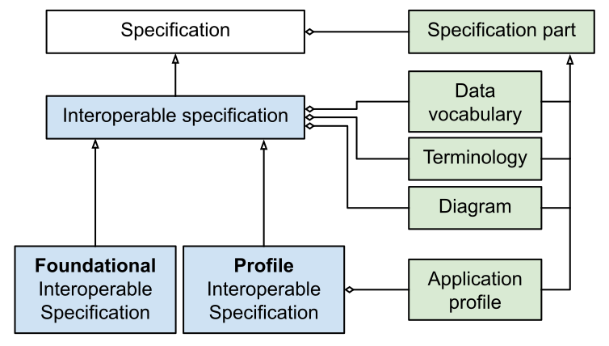

# Rules for interoperable specifications

The rules for interoperable specifications are divided into six parts. The first five apply to anyone creating or distributing an interoperable specification, the last one applies mainly to actors harvesting interoperable specifications:

1. Rules for interoperable specifications - PROF-INSPEC - based on [[[DX-PROF]]]
2. Rules for data vocabularies - RDFS-INSPEC - based on [[[RDF-SCHEMA]]]
3. Rules for terminologies - SKOS-INSPEC - based on [[[SKOS-REFERENCE]]]
4. Rules for application profiles - SHACL-INSPEC - based on [[[SHACL]]]
5. Rules for diagrams - SVG-INSPEC - based on [[[SVG11]]]
6. Rules for enriching the interoperable specifications - ENRICH-INSPEC

## Rules for interoperable specifications - PROF-INSPEC

For a specification to be considered a interoperable specification the following must apply:

A specification needs to be considered as a container, which consists of one or more specification parts. In order to connect and describe the different specification parts we make use of the PROF vocabulary, designed to describe profiles and specifications. The purpose of an interoperable specification is the reuse of it and its parts, they must therefore each be given webb-scale suitable unique identifiers, for which we use URIs. The interoperable specification must additionally self-identify as an interoperable specification for which we use the INSPEC vocabulary.

> **Rule PROF-1:** The "interoperable specification resource" and its parts MUST have URIs and be described with PROF, the interoperable specification resource MUST be typed as `prof:Profile` or `dcterms:Standard` and have a `dcterms:conformsTo` point to `inspec:PROF`

While a specification may consist of many parts only the data vocabularies, terminologies, application profiles and diagrams are considered by the INSPEC profile. These parts must abide by the rules set out below and self-identify as conforming to the relevant INSPEC rule-set. A specification may contain additional parts but these are not considered reusable and they don't need to follow any rules other than PROF-1 above. Subclassing, for the purpose of clarifying which characteristics are expected on a set of instances, complicates reuse. For this reason an interoperable specification makes use of application profiles instead.

> **Rule PROF-2:** All specification parts MUST be indicated via the `prof:hasResource` property from the interoperable specification and be typed as `prof:ResourceDescriptor`. An interoperable specification part MAY be a data vocabulary, a terminology, an application profile or a diagram. Other parts may exist but have no prescribed meaning by the interoperable specification profile.

For vocabularies (classes and properties) we make use of RDFS, the standard recommended by the European interoperability framework.

> **Rule PROF-3:** Each data vocabulary MUST be detected by `dcterms:conformsTo` pointing to `inspec:RDFS` and MUST be possible to interpret as RDFS-INSPEC.

For terminologies we make use SKOS which is domain independent.

> **Rule PROF-4:** Each terminology MUST be detected by `dcterms:conformsTo` pointing to `inspec:SKOS` and MUST be possible to interpret as SKOS-INSPEC.

To describe application profiles we make use of SHACL, which is W3C recommended.

> **Rule PROF-5:** Each application profile MUST be detected by `dcterms:conformsTo` pointing to `inspec:SHACL` and MUST be possible to interpret as SHACL-INSPEC

For diagrams we require SVG as this is an open format which allows for interaction, is light weight and is supported by all modern browsers.

> **Rule PROF-6:** A diagram MUST be detected by `dcterms:conformsTo` property pointing to `inspec:SVG` and MUST follow SVG-INSPEC

In INSPEC we distinguish between foundational and profile interoperable specification (see [design](design.md#foundational-specifications)). For foundational interoperable specification we require that it introduces at least a data vocabulary or a terminology, and we disallow it from containing an application profile.

> **Rule PROF-7:** A **foundational** interoperable specification MUST contain at least one data vocabulary or one terminology, MUST NOT contain an application profile and MUST be typed as `dcterms:Standard`

For the profile interoperable specification the focus is the application profile describing how the data vocabulary (also required), and any terminologies, are used.

> **Rule PROF-8:** A **profile** interoperable specification MUST contain at least one application profile and MUST be typed as `prof:Profile`

> **Rule PROF-9:** A profile interoperable specification MUST list all data vocabularies and terminologies it **uses** in the application profile explicitly as interoperable specification parts

To allow the discovery of all specification parts which are relevant to a specification we require that it explicitly presents and describes all of the parts that it reuses and builds on.

> **Rule PROF-10:** Interoperable specification parts that are **reused** (as opposed to **introduced**) SHOULD indicate that by referring to the interoperable specification where they where introduced via the `prof:isInheritedFrom` property

## Rules for data vocabularies - RDFS-INSPEC

RDFS-INSPEC builds on top of the RDF Schema specification by providing the following additional restrictions:

To work in the context of semantic specifications where it is stated explicitly what is included, we need to assume that everything needed is provided in the indicated RDF Datasets.

> **Rule DV-1:** A data vocabulary MUST be expressed in a single RDF Dataset.<a href="#fn1" id="fn1_1">[1]</a>

TODO

> **Rule DV-2:** There MUST be a single "data vocabulary resource" typed as `owl:Ontology` in the RDF Dataset

In order to be reusable the components of the data vocabulary need to be both discoverable, by pointing to the data vocabulary resource, and referenceable, by having URIs.

> **Rule DV-3:** All included classes and properties of the data vocabulary MUST point to the "data vocabulary resource" via the `rdfs:isDefinedBy` property

> **Rule DV-4:** All included classes and properties as well as the data vocabulary resource MUST have URIs

In order to be more self-contained those classes and properties that are needed to introduce new subclasses/-properties may also be included. They however need to be clearly distinguished in order to avoid being confused for local classes and properties.

> **Rule DV-5:** Classes and properties from other vocabularies MAY be included in the RDF Dataset, e.g. when being pointed to via `rdfs:subClassOf` and `rdfs:subProperty`, but MUST NOT point to the same "data vocabulary resource" via the `rdfs:isDefinedBy` property

TODO

> **Rule DV-6:** The "data vocabulary resource" MUST be indicated via the `dcterms:subject` property from the "interoperable specification part" (introduced in Rule PROF-2).

## Rules for terminologies - SKOS-INSPEC

SKOS-INSPEC builds on top of the SKOS specification by providing the following additional restrictions:

To work in the context of semantic specifications where it is stated explicitly what is included, we need to assume that everything needed is provided in the indicated RDF Datasets.

> **Rule TE-1:** A terminology MUST be expressed in a single RDF Dataset.<a href="#fn1" id="fn1_2">[1]</a>

TODO

> **Rule TE-2:** There MUST be a single "terminology resource" with a URI typed as `skos:ConceptScheme` in the RDF Dataset

In order to be reusable the components of the terminology need to be both discoverable, by pointing to the terminology resource, and referenceable, by having URIs.

> **Rule TE-3:** All concepts and collections in the terminology MUST point to the "terminology resource" via the `skos:inScheme` property

> **Rule TE-4:** All concepts, collections as well as the terminology resource MUST have URIs

TODO

> **Rule TE-5:** The "terminology resource" MUST be indicated via the `dcterms:subject` property from the "interoperable specification part" (introduced in Rule PROF-2).

## Rules for application profiles - SHACL-INSPEC

SHACL-INSPEC builds on top of the SHACL specification by providing additional restrictions. Since SHACL is a rich language the following rules does not cover all situations. For instance, the following rules does not indicate how to specify how to restrict to concepts from a specific terminology. For a more complete treatment see the [SHACL-INSPEC separate document](ap.md) for patterns on how to use the profile in various situations.

To work in the context of semantic specifications where it is stated explicitly what is included, we need to assume that everything needed is provided in the indicated RDF Datasets.

> **Rule AP-1:** An application profile MUST be expressed in a single RDF Dataset<a href="#fn2" id="fn2_1">[2]</a>

TODO

> **Rule AP-2:** There MUST be a single "application profile resource" with a URI in the RDF Dataset AND it MUST be the same as the "interoperable specification resource" (introduced in Rule PROF-1)

In order to be reusable the components of the application profile, property and node shapes, need to be referenceable, by having a URI. Not all shapes need be reusable however, reusability is therefore determined through the severity of the shape.

> **Rule AP-3:** All property shapes with a severity of `sh:Violation` and with at least one constraint (`sh:and` for specialization does not count) are considered **public** and they MUST have URIs

> **Rule AP-4:** All node shapes with a severity of `sh:Violation` are considered **public** and MUST have URIs

TODO - We distinguish between main and supportive node shapes...

> **Rule AP-5:** Public node shapes are considered **main** if they have a target declaration, otherwise they are considered **supportive**

To further facilitate reuse we also require that reusable shapes are provided with a label. While a definition and usage notes further facilitate reuse, these are not mandatory.

> **Rule AP-6:** All public node shapes, as well as all property shapes pointed to from those, MUST provide a label and MAY also provide a definition and a usage note

We introduce two concepts describing inheritance between reusable shapes, that a shape "refines" another by adding additional constraints to it, or that it is a "variant" of another shape if it relaxes some of its constraints. These relations are expressed on both property and node shapes by the corresponding INSPEC properties in order to make this more easy to query.

> **Rule AP-7:** A property shape MAY express that it **refines** a public property shape via both the `inspec:refines` property as well as via a `sh:and` construct, the latter to be compatible with normal SHACL validation.

> **Rule AP-8:** A property shape MAY express that it is a **variant** of a public property shape via the `inspec:variant` property

A reusable node shape refines another if shares all of the others constraints (property shapes), or refinements of these. A reusable node shape is a variant of another if shares all of the others constraints, or refinements or variants of these with at least one of the constraints being a variant. In both cases the nodes may have additional constraints.

> **Rule AP-9:** A node shape *B* MAY express that it **refines** a public node shape *A* via the `inspec:refines` property only if for every property shape *X* in *A* either *X* or a refinement *Y* of *X* is in *B*.

> **Rule AP-10:** A node shape *B* MAY express that it is a **variant** of a public node shape *A* via the `inspec:variant` property only if for every property shape *X* in *A* either *X* or *Y* is in *B* where *Y* is a refinement or a variant of *X*. At least one of the property shapes must be a variant and not a refinement.

An application profile refines another if it shares all of its constraints (node shapes), or refinements of these. An application profile is a variant of another if shares all of the others constraints, or refinements or variants of these with at least one of the constraints being a variant. In both cases the application profile may have additional constraints. These relations are expressed using the corresponding INSPEC properties.

> **Rule AP-11:** An application profile *B* MAY express that it is a **subprofile of** of an application profile *A* via the `inspec:refines` property only if for every node shape *X* in *A* there is a refined node shape *Y* in *B*.

> **Rule AP-12:** An application profile *B* MAY express that it is a **variant** of a application profile *A* via the `inspec:variant` property only if for every node shape *X* in *A* there is a variant or refined node shape *Y* in *B*, at least one of the node shapes must be a variant and not a refinement.

TODO

> **Rule AP-13:** All shapes of the application profile MUST point to the "application profile resource" via the `rdfs:isDefinedBy` property

TODO

> **Rule AP-14:** Shapes used for refinement or for variants MAY reside in other RDF Datasets as long as the dataset is pointed to via `owl:imports` AND there is either a `inspec:refines` or a `inspec:variant` relation between the application profile resources.

TODO

> **Rule AP-15:** Shapes from other application profiles used for refinement or for variants MAY be included in the RDF Dataset but MUST NOT point to the same "application profile resource" via the `rdfs:isDefinedBy` property

## Rules for diagrams - SVG-INSPEC

SVG-INSPEC builds on top of SVG to provide a way to clarify whether objects in a diagram corresponds to an entity recognized in interoperable specifications, i.e. a class, a property, a node-shape, a property-shape, a concept, a terminology, or a concept collection. Also interoperable specifications or foundational specifications should be possible to indicate as well as diagrams and data vocabularies if they are included in the diagram. Note that there are no hard restrictions on the diagrammatic style used. Although it should be noted that it is good idea to choose a style that is well known like something akin to UML class diagrams.

Note that, as diagrams are not mandatory, an interoperable specification may include a diagram which are not INSPEC compatible (e.g. a bitmap image), as long as this is not marked as conforming to `inspec:SVG`.

In order to make the diagram interactive we require that it explicitly makes clear what entity each visualised element corresponds to. By using href and the URI it becomes possible to navigate between the diagram and the other specification parts.

> **Rule SVG-1:** An element corresponding to an INSPEC entity MUST have a href pointing to it's URI. If the element corresponds to two things, e.g. both a class and a node-shape, the URI of the dominant one should be used.

To help with visually classifying elements in the diagram we introduce a data attribute to be added to each element to clarify the type of entity it corresponds to. Multiple values can be listed.

> **Rule SVG-2:** An element corresponding to an INSPEC entity MUST have a custom data attribute on the form `data-inspec-type="TYPE"` where TYPE is one of foundational, application-profile, diagram, data-vocabulary, class, property, node-shape, property-shape, concept, terminology and concept-collection. If the element corresponds to two things, e.g. both a class and a node-shape they can be listed both with a separating comma, the first should be considered dominant.

We provide an additional identifier on each element, directly derived from the URI of the corresponding entity. This identifier is compatible with CSS-selectors in order to allow for a more interactive diagram.

> **Rule SVG-3:** An element corresponding to an INSPEC entity MAY have an id on the form `id="d_EID"` where EID is the md5 sum<a href="#fn3" id="fn3_1">[3]</a> of the entity's URI.

Further data attributes ar provided to also allow for the encoding of the reusability of a node or property shape and whether a node shape is main or supportive.

> **Rule SVG-4:** An element with type node-shape or property-shape MAY have a custom data attribute on the form `data-inspec-public="true"` if it is public according to rule AP-3 or AP-4.

> **Rule SVG-5:** An element with type node-shape that is also public MAY have a custom data attribute on the form `data-inspec-weight="WEIGHT"` where WEIGHT is either "main" or "supportive" according to rule AP-5.

## Rules for enriching the interoperable specifications - ENRICH-INSPEC

This set of rules aim to enrich the interoperable specification by analysing the contents of, and interaction between, the different interoperable specification parts in order to surface information which may be valuable for a webb of interoperable specifications.

In order to be discoverable the components of the application profile, property and node shapes, should be pointed to from the application profile.

> **Rule ENRICH-1:** Every public property or node shape MAY be pointed to from the "interoperable specification resource" (introduced in Rule PROF-1) via the `dcterms:hasPart` property.

TODO

> **Rule ENRICH-2:** For a profile interoperable specification all classes and properties referred to via shapes MAY be explicitly indicated from the "interoperable specification resource". The indication SHOULD use `inspec:reuses` if the referred resource is part of a **reused** specification part (see Rule PROF-10), otherwise `inspec:introduces` SHOULD be used.

TODO

> **Rule ENRICH-3:** For a foundational interoperable specification all classes and properties defined by (see Rule DV-3) an **introduced** data vocabulary MAY be explicitly indicated from the "interoperable specification resource" using `inspec:introduces`.

TODO

> **Rule ENRICH-4:** If a `inspec:refines` relation is present in the application profile resource the specification introducing the refined application MAY be indicated from the "interoperable specification resource" using `prof:isProfileOf`.

<section id="footnotes" style="font-size:smaller;border-top:1px solid" class="informative">
<ol>
 <li id="fn1">Both RDFS and SKOS introduce building blocks (classes and properties) for defining things (other classes, properties, concepts, collections) in an open world manner. However, both vocabularies and terminologies needs to work in the context of semantic specifications where it is stated explicitly what is included, hence it corresponds to a closed world perspective. Hence, in both RDFS-INSPEC and SKOS-INSPEC there is a restriction to assume that everything needed is provided in the indicated RDF Datasets. <a href="#fn1_1">↩1</a><a href="#fn1_2">↩2</a></li>
 <li id="fn2">SHACL supports imports declared via `owl:imports`, the rules are written from the perspective that these are respected and all RDF Datasets (potentially recursively) are imported first into a single RDF Dataset. <a href="#fn2_1">↩</a></li>
 <li id="fn3">The id value could in principle be the URI, however, it is highly likely that we want to write CSS rules targeting individual elements and then we need to be more restrictive as CSS rules cannot use URIs as part of selectors. <a href="#fn3_1">↩</a></li>
</ol>
</section>
